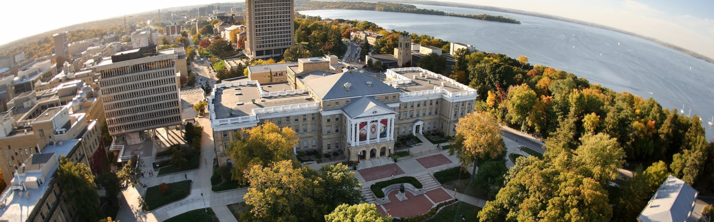

 
##### Filling up my cup! 

Heavily involved with UW-Madison's Economics deparment during my undergraduate years, I was invited and elected to be a part of UW-Madison's Economics Alumni Board. As one of 8 alumni, I advise and engage with departamental intiatives, and provide mentorship for current students. 

I'm so grateful fo all the opportunities the UW-Madison commumnity afforded me and working with current students truly fills up my cup! 

<iframe src="https://econ.wisc.edu/staff/brandsma-ericka/
" width="700" height="500" style="border:0;" allowfullscreen="" loading="lazy"></iframe>